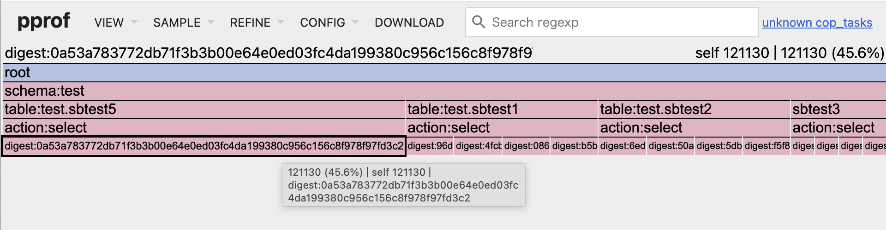

# tidb-statements-pprof

**tidb-statements-pprof** is a tool for visualizing TiDB SQL statement metrics in the form of pprof profiles.  
It helps you analyze TiDB statement performance and resource usage from multiple dimensions.

## Supported Metrics

- Latency
- Processed Keys
- Process Time
- Cop Tasks
- Resource Unit

A sample:



## Usage

### Analyze TiDB `information_schema.cluster_statements_summary` directly

```sh
go run main.go "root:@tcp(127.0.0.1:4000)/" <output_pprof_file>
```

### Analyze statements CSV file exported from TiDB Dashboard

```sh
go run main.go test/statements_sysbench.csv <output_pprof_file>
```

### View the generated pprof file

```sh
go tool pprof -http=:8080 <output_pprof_file>
```

Open your browser and visit: [http://127.0.0.1:8080/](http://127.0.0.1:8080/)

## How it works

- For MySQL/TiDB connection, the tool queries `information_schema.cluster_statements_summary` to collect statement statistics such as latency, processed keys, cop tasks, process time, and resource units.
- For CSV input, it parses the exported statements data and generates a pprof file based on the same metrics.
- The output pprof file can be visualized using standard Go pprof tools.

## Requirements

- Go 1.18+
- Access to TiDB or a compatible MySQL server (for direct DB analysis)
- CSV file exported from TiDB Dashboard (for offline analysis)
